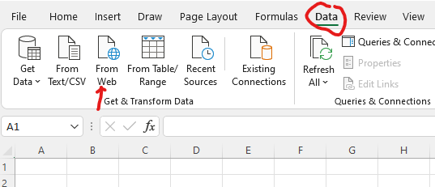
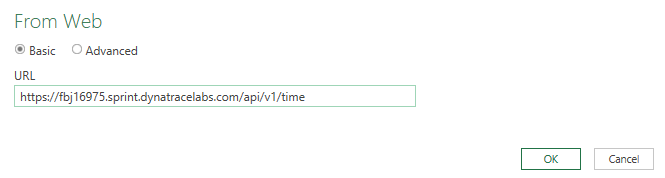
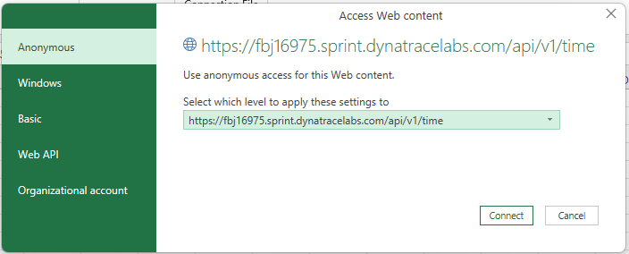
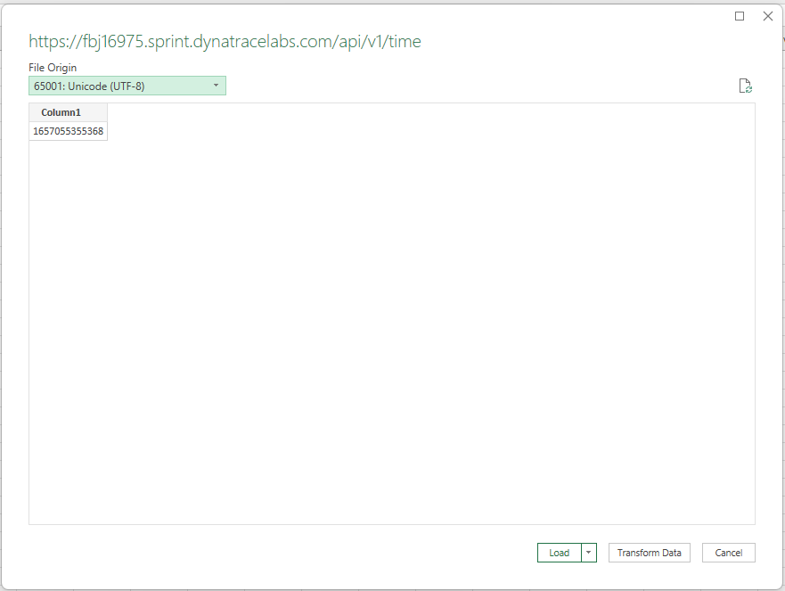
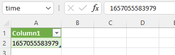
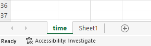
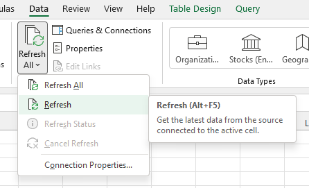
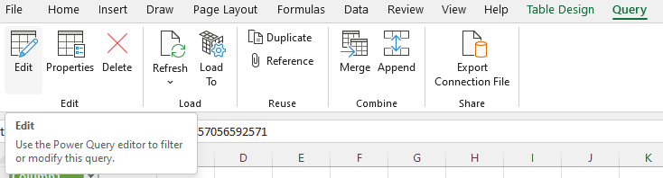
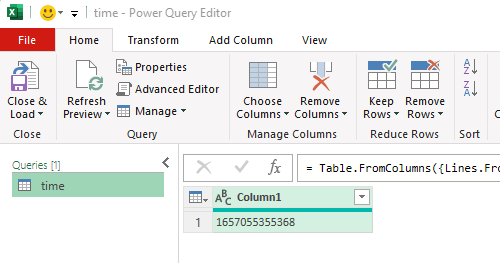
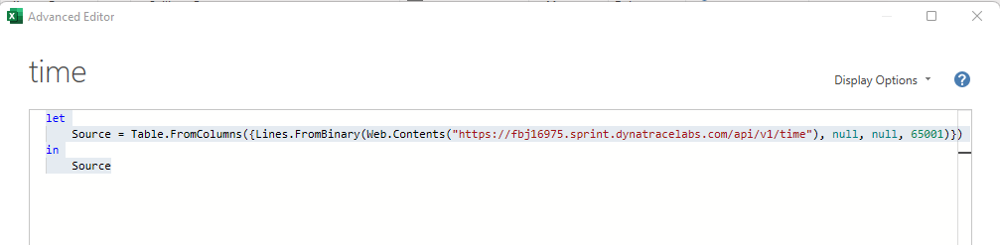

# Dynatrace API - Excel integration tutorial

## Initial connection

In Dynatrace API there exists a single endpoint which doesn't require authentication.
We'll use that endpoint on our Dynatrace tenant to set up the initial connection.  
- https://{tenantURL}/api/v1/time

### Create new Excel sheet

### Import data from Web

Start the data import wizard from the menu 'Data', 'From Web' in the 'Get & Transform Data' section  

### Set the API Endpoint

Keep 'basic' settings, fill in the API endpoint URL, and click 'OK'  

### Confirm security

On the access dialog, select 'Anonymous' and change the level to the full endpoint URL.

### Preview and Load data

Change the input codepage to unicode 'utf-8' and load the data

### Result

A new sheet will be added to the workbook, with the last part of the URL 'time' as name.
A table with a single column and row will be displayed, containing the cluster timestamp.  

### Refresh

Refresh the data - the timestamp will increase  

### Check the query detail

From the 'Query' menu, click on 'Edit'  

In Power Query Editor, from the 'Home' menu, click on 'Advanced editor'  

In the editor, you'll see the following code

     let
         Source = Table.FromColumns(
             { Lines.FromBinary(Web.Contents("https://fbj16975.sprint.dynatracelabs.com/api/v1/time"),
               null, null, 65001)
             })
     in
         Source

You can close this dialog by clicking on 'Done', and then you can close the Power Query Editor

[Example Excel Sheet](Initial.xlsx)
