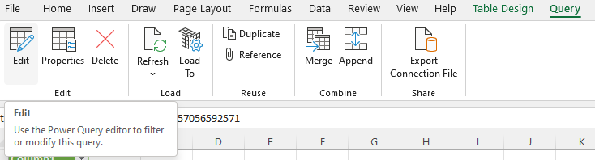
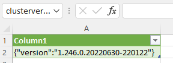

# Dynatrace API - Excel integration tutorial

## Authentication

The next Dynatrace API endpoint will be the clusterversion. This endpoint requires authentication.
- https://{tenantURL}/api/v1/config/clusterversion

### Copy the 'Time' Excel sheet

Copy and rename the Excel sheet - this will also create a copy of the DataSource Connection  

### Open Power Query Editor 

Open the Power Query Editor from the menu 'Query', 'Edit' in the 'Edit' section  

### Rename the query

In Power Query Editor, rename the query  

### Open advanced editor

From the 'Home' menu, click 'Advanced Editor'  

### Update the endpoint and add Api Key

In the editor, modify the endpoint and add the name for the Api Key

     let
         Source = Table.FromColumns({Lines.FromBinary(Web.Contents("https://fbj16975.sprint.dynatracelabs.com/api/v1/config/clusterversion",[ApiKeyName="api-token"]), null, null, 65001)})
     in
         Source

At this point you should get a credentials warning.  

From the 'Home' menu, click on 'Close & Load'

### Switch to Web API authentication

Switch to Web API authentication and paste your Dynatrace API Token into the Key field
Change the applicable level to https://{tenantURL}/api

### Result

After clicking connect, you should have the following result. Note that this API call didn't return a simple value, but a JSON String.  

[Example Excel Sheet](Authentication.xlsx)
