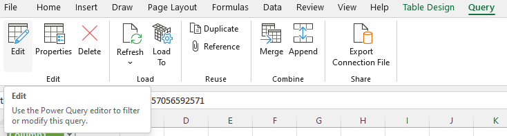
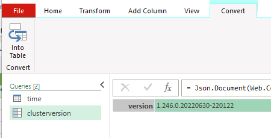
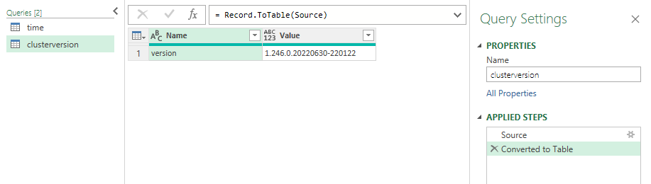
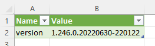

# Dynatrace API - Excel integration tutorial

## JSON

Most of the Dynatrace API endpoints will return JSON-formatted output

### Open Power Query Editor 

Open the Power Query Editor from the menu 'Query', 'Edit' in the 'Edit' section  

### Open advanced editor

Select the clusterversion query.  
From the 'Home' menu, click 'Advanced Editor'  

### Update the endpoint and add Api Key

In the editor, replace the script with following code

     let
         Source = Json.Document(Web.Contents("https://fbj16975.sprint.dynatracelabs.com/api/v1/config/clusterversion",[ApiKeyName="api-token"]), 65001)
     in
         Source

### Convert JSON to table

From the menu 'Convert', click 'Into Table'  
  
A new step will be added to the document handling.  
  

Check in the Advanced Editor - the code has changed to the following  

    let
        Source = Json.Document(Web.Contents("https://fbj16975.sprint.dynatracelabs.com/api/v1/config/clusterversion",[ApiKeyName="api-token"]), 65001),
        #"Converted to Table" = Record.ToTable(Source)
    in
        #"Converted to Table"

### Result

After clicking "Close & Load", you should have the following result.  

[Example Excel Sheet](JSon.xlsx)
