# Dynatrace API - Excel integration tutorial

## Multi Tenant

Customers will have acces to multiple tenants or environments (Production, Acceptance, Staging, Development, etc...)  
This chapter show how to add parameters in a sheet which will allow you to easily switch between tenants.

### Create a new Sheet 

Create a new Excel sheet in your workbook, called 'setup'  
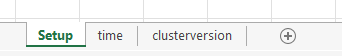

### Populate Sheet

Populate the sheet with data as follows:  
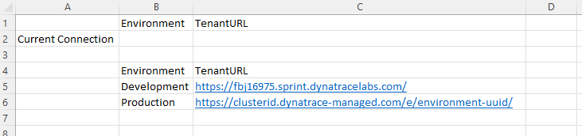

### Format and Sort the Table

Format the lower part of the sheet as table    
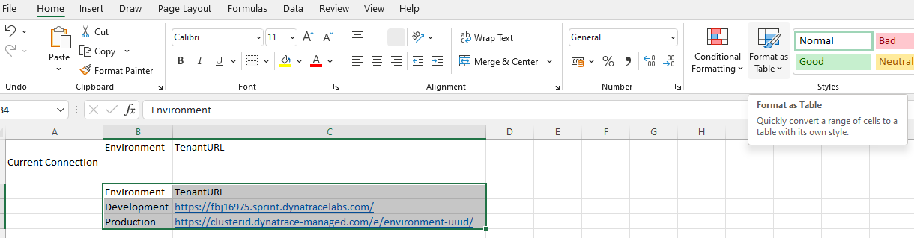  

Choose Layout and create the table with headers  
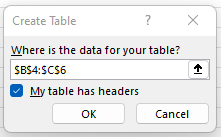  

Sort the Table A->Z on Environment (If the table is not sorted, the lookups won't work properly)  
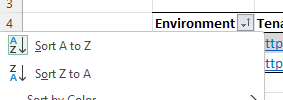  

Rename the table "TenantTable": in "Table Design" menu, change the name in the "properties" section
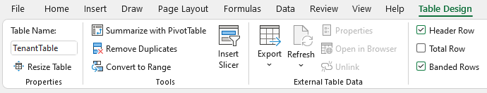  

### Configure Lookup

Select Cell B2 (Current Connection/Environment)
From the menu 'Data', click 'Data Validation' from the 'Data Tools' section  
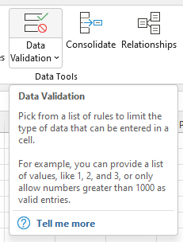  

Change 'Allow:' to 'List' and select the environment column data as source  
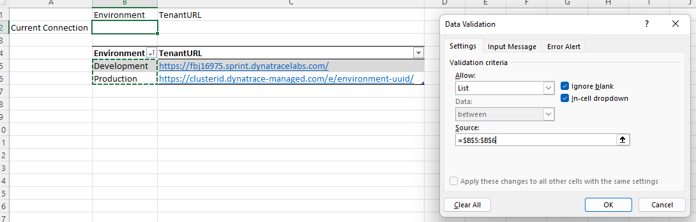  

The selected field has been converted to a dropdown field, select a value, and edit the formula under TenantURL  

      =CONCAT(VLOOKUP(B2;TenantTable;2);"api")  
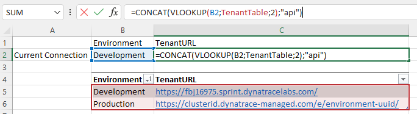  

The TenanURL is now dynamically changed with the value from the table when choosing a different environment.

### Make the URL Referenceable

Select the cell C2 (where the dynamic TenantURL value is displayed), change the Cell Reference to 'TenantURL'  
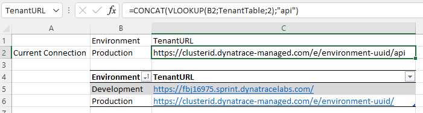  

### Update the Queries

From the Menu 'Data', click 'Queries and Connections'  
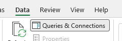  

Select a Query from the 'Queries and Connections' Panel, and click 'Edit' to open the Power Query Editor
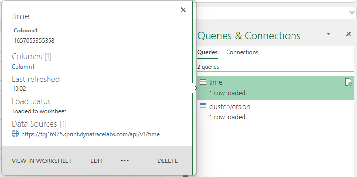  

### Update the script code

From the 'Home' menu, open the 'Advanced Editor'
Change the Queries as follows:  
- time

    let
        DynatraceEndpoint = Excel.CurrentWorkbook(){[Name="TenantURL"]}[Content]{0}[Column1] & "/v1/time",
        Source = Table.FromColumns({Lines.FromBinary(Web.Contents(DynatraceEndpoint), null, null, 65001)})
    in
        Source

- clusterversion

    let
        DynatraceEndpoint = Excel.CurrentWorkbook(){[Name="TenantURL"]}[Content]{0}[Column1] & "/v1/config/clusterversion",
        Source = Json.Document(Web.Contents(DynatraceEndpoint,[ApiKeyName="api-token"]), 65001),
        #"Converted to Table" = Record.ToTable(Source)
    in
        #"Converted to Table"

A privacy notice may appear - set the appropriate levels for your Organization ('public' should be ok, users need to enter their API Token anyway)
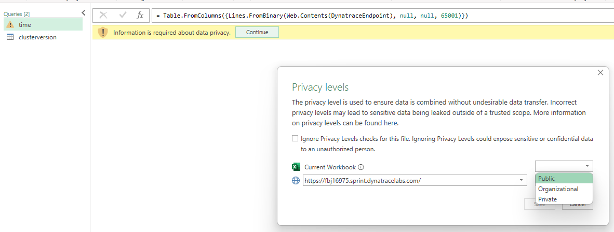  

### Result

After clicking "Close & Load", you can select a different environment from the dropdown list, and refresh all queries:  

- For the time query, select anonymous, and apply to the full endpoint URL.
- For the clusterversion query, select Api Key, paste your Dynatrace API Token for that corresponding environment and apply to https://{tenantURL}/api  

[Example Excel Sheet](MultiTenant.xlsx)
