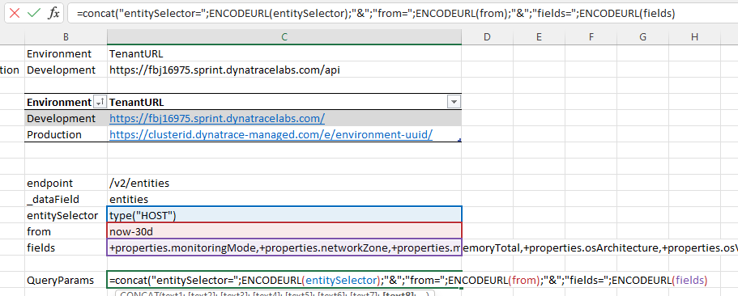
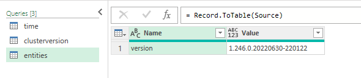
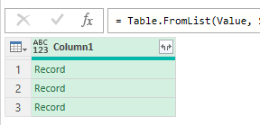
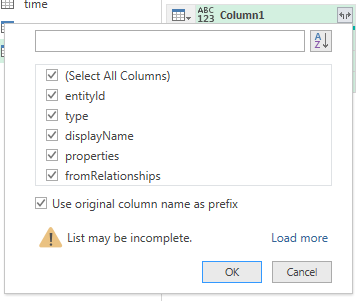
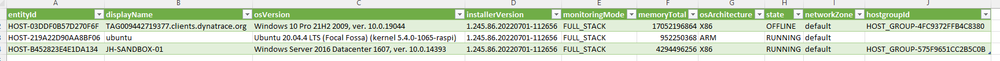

# Dynatrace API - Excel integration tutorial

## Query Parameters

Dynatrace API endpoints can have query parameters to select entities, filter scopes, set time periods, etc ...  
For this lab we will create an [entity list query](https://www.dynatrace.com/support/help/dynatrace-api/environment-api/entity-v2/get-entities-list).  

### Open the Setup sheet 

In the Excel workbook, open the setup sheet.  
Add the following fields (check the API documentation for other parameters/filters/selectors/fields ...)  
- endpoint : '/v2/entities
- _dataField : entities
- entitySelector : type("HOST")
- from : now-30d
- fields : +properties.monitoringMode,+properties.networkZone,+properties.memoryTotal,+properties.osArchitecture,+properties.osVersion,+properties.installerVersion,+properties.state,+fromRelationships.isInstanceOf

Name the cells containing the values according to their given title.  
Then add a calculated field that concatenates the above URLencoded values (and name this field URLQuery)  

- QueryParams : =CONCAT("entitySelector=";ENCODEURL(entitySelector);"&";"from=";ENCODEURL(from);"&";"fields=";ENCODEURL(fields))

  

### Copy the clusterversion sheet

Make a copy of the "clusterversion" sheet.  
Rename the new sheet "entities"
Open the Power Query Editor
Rename the Query "entities"

  

### Update the query

Open the "Advanced Editor", replace the script with following code

    let
        DynatraceQuery = Excel.CurrentWorkbook(){[Name="TenantURL"]}[Content]{0}[Column1] & 
            Excel.CurrentWorkbook(){[Name="endpoint"]}[Content]{0}[Column1] & "?" &
            Excel.CurrentWorkbook(){[Name="QueryParams"]}[Content]{0}[Column1],
        Source = Json.Document(Web.Contents(DynatraceQuery,[ApiKeyName="api-token"]), 65001),
        #"Selected _dataField" = Record.FieldValues(Record.SelectFields(Source,Excel.CurrentWorkbook(){[Name="_dataField"]}[Content]{0}[Column1])){0},
        #"Converted to Table" = Table.FromList(#"Selected _dataField", 
            Splitter.SplitByNothing(), null, null, ExtraValues.Error),
    in
        #"Converted to Table"    

### Drill down the List data

Click on the arrows icon in the "Column1" header

  

Repeat the arrows for "properties"  
Repeat the arrows for "fromRelationships"  
Repeat the arrows for "fromRelationships.isInstanceOf" - select "Expand to new rows"  
Repeat the arrows for "fromRelationships.isInstanceOf"  

Open "Advanced Editor" to remove unnecessary columns ("type") and shorten column names

    let
        DynatraceQuery = Excel.CurrentWorkbook(){[Name="TenantURL"]}[Content]{0}[Column1] & 
            Excel.CurrentWorkbook(){[Name="endpoint"]}[Content]{0}[Column1] & "?" &
            Excel.CurrentWorkbook(){[Name="QueryParams"]}[Content]{0}[Column1],
        Source = Json.Document(Web.Contents(DynatraceQuery,[ApiKeyName="api-token"]), 65001),
        #"Selected _dataField" = Record.FieldValues(Record.SelectFields(Source,
            Excel.CurrentWorkbook(){[Name="_dataField"]}[Content]{0}[Column1])){0},
        #"Converted to Table" = Table.FromList(#"Selected _dataField", 
            Splitter.SplitByNothing(), null, null, ExtraValues.Error),
        #"Expanded Column1" = Table.ExpandRecordColumn(#"Converted to Table", "Column1", 
            {"entityId", "displayName", "properties", "fromRelationships"}, 
            {"entityId", "displayName", "Column1.properties", "Column1.fromRelationships"}),
        #"Expanded Column1.properties" = Table.ExpandRecordColumn(#"Expanded Column1", "Column1.properties", 
            {"osVersion", "installerVersion", "monitoringMode", "memoryTotal", "osArchitecture", "state", "networkZone"}, 
            {"osVersion", "installerVersion", "monitoringMode", "memoryTotal", "osArchitecture", "state", "networkZone"}),
        #"Expanded Column1.fromRelationships" = Table.ExpandRecordColumn(#"Expanded Column1.properties", 
            "Column1.fromRelationships", {"isInstanceOf"}, {"Column1.fromRelationships.isInstanceOf"}),
        #"Expanded Column1.fromRelationships.isInstanceOf" = Table.ExpandListColumn(#"Expanded Column1.fromRelationships", 
            "Column1.fromRelationships.isInstanceOf"),
        #"EntityList" = Table.ExpandRecordColumn(
            #"Expanded Column1.fromRelationships.isInstanceOf", 
            "Column1.fromRelationships.isInstanceOf", {"id"}, {"hostgroupId"})
    in
        #"EntityList"
    

### Result

After clicking "Close & Load", you should have the following result.  

[Example Excel Sheet](QueryParameters.xlsx)
