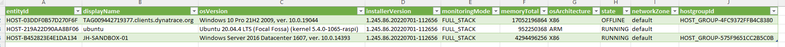

# Dynatrace API - Excel integration tutorial

## Pagination

For performance reasons, Dynatrace will limit the number of results returned by API requests. Therefor these API endpoints provide the pageSize parameter to increase or decrease the default number of returned records. Even then, in large environments or for detailed queries, the resultset can be so large it needs to be split over multiple queries.
When this happens, Dynatrace will provide a nextPageKey, and then the same API endpoint can be called with only that key as parameter to fetch the next page. On the last page, the nextPageKey will be empty.  

### Open the Setup sheet 

In the Excel workbook, open the setup sheet.  
Review the following fields  
- endpoint : '/v2/entities
- _dataField : entities
- entitySelector : type("HOST")
- from : now-30d
- fields : +properties.monitoringMode,+properties.networkZone,+properties.memoryTotal,+properties.osArchitecture,+properties.osVersion,+properties.installerVersion,+properties.state,+fromRelationships.isInstanceOf

Name the cells containing the values according to their given title.  
Modify the calculated field that concatenates the above URLencoded values (and rename this field QueryParams)  

- QueryParams : =CONCAT("entitySelector=";ENCODEURL(entitySelector);"&";"from=";ENCODEURL(from);"&";"fields=";ENCODEURL(fields))

### Update the query

    let
        FnGetOnePage = (url, params, datafield, nextpage) as record =>
            let
                urlp =   if nextpage = null then url & "?" & params else url & "?nextPageKey=" & nextpage,
                Source = if nextpage = ""   then null else Json.Document(Web.Contents(urlp,[ApiKeyName="api-token"]), 65001),
                data =   if nextpage = ""   then null else try Record.FieldValues(Record.SelectFields(Source,datafield)){0}    otherwise null,
                next =   if nextpage = ""   then null else try Source[nextPageKey] otherwise "",
                res = [Data=data, Next=next]
            in
                res,
                
        DynatraceEndpoint = Excel.CurrentWorkbook(){[Name="TenantURL"]}[Content]{0}[Column1] & 
            Excel.CurrentWorkbook(){[Name="endpoint"]}[Content]{0}[Column1],
        QueryParams= Excel.CurrentWorkbook(){[Name="QueryParams"]}[Content]{0}[Column1],
        DataField=Excel.CurrentWorkbook(){[Name="_dataField"]}[Content]{0}[Column1],
        GeneratedList = List.Generate( ()=>[ res = FnGetOnePage(DynatraceEndpoint,QueryParams,DataField,null)] ,
            each [res][Next] <> null,
            each [res = FnGetOnePage(DynatraceEndpoint,QueryParams,DataField,[res][Next])],
            each [res][Data]),
            
        #"Converted to Table" = Table.FromList(GeneratedList, 
            Splitter.SplitByNothing(), null, null, ExtraValues.Error),
        #"Expanded Column2" = Table.ExpandListColumn(#"Converted to Table", "Column1"),
        #"Expanded Column1" = Table.ExpandRecordColumn(#"Expanded Column2", "Column1", 
            {"entityId", "displayName", "properties", "fromRelationships"}, 
            {"entityId", "displayName", "Column1.properties", "Column1.fromRelationships"}),
        #"Expanded Column1.properties" = Table.ExpandRecordColumn(#"Expanded Column1", "Column1.properties", 
            {"osVersion", "installerVersion", "monitoringMode", "memoryTotal", "osArchitecture", "state", "networkZone"}, 
            {"osVersion", "installerVersion", "monitoringMode", "memoryTotal", "osArchitecture", "state", "networkZone"}),
        #"Expanded Column1.fromRelationships" = Table.ExpandRecordColumn(#"Expanded Column1.properties", 
            "Column1.fromRelationships", {"isInstanceOf"}, {"Column1.fromRelationships.isInstanceOf"}),
        #"Expanded Column1.fromRelationships.isInstanceOf" = Table.ExpandListColumn(#"Expanded Column1.fromRelationships", 
            "Column1.fromRelationships.isInstanceOf"),
        #"EntityList" = Table.ExpandRecordColumn(#"Expanded Column1.fromRelationships.isInstanceOf", 
            "Column1.fromRelationships.isInstanceOf", {"id"}, {"hostgroupId"})
    in
        #"EntityList"
    

### Result

After clicking "Close & Load", you should have the following result.  

[Example Excel Sheet](Pagination.xlsx) 
